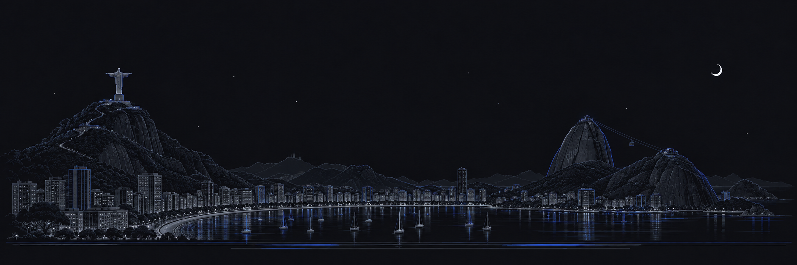

Hey! I'm [**@medioalanum**](https://github.com/medioalanum) **(Alan Viana)**. 👋

I'm a Senior Technical Product Manager from Brazil. 🇧🇷

I currently live in Italy. 🇮🇹

I'm normally doing things around platforms, APIs, integrations, and data.

I'm also building software with Python, with a growing focus on backend systems and data engineering.

You can find me on:

- [My website: medioalanum.github.io](https://medioalanum.github.io/)
- [LinkedIn](https://www.linkedin.com/in/alanviana/)
